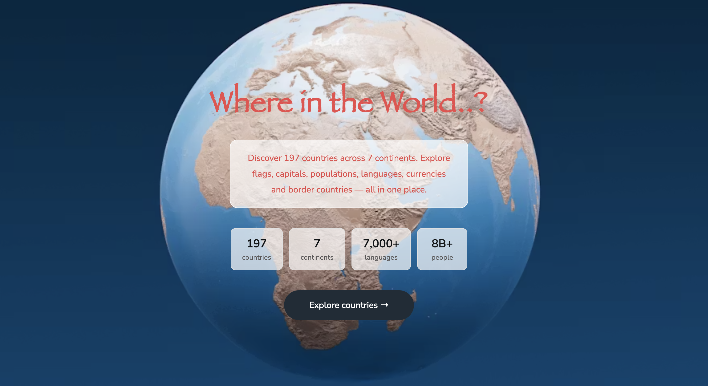

# Welcome to REST Countries API with color theme switcher

A responsive country explorer app built with HTML, CSS, and Javascript. App allows users to search and explore detailed information about every country in the world.



## Description

Explore every country on Earth with real-time search, region filtering, and detailed country pages. Built with the REST Countries API, this app displays flags, populations, capitals, languages, regions, subregions, and border countries...

## Languages

- HTML
- CSS
- Javascript

## Libraries, Fonts & Icons

- Bootstrap
- Font Awesome
- Google Fonts

## API

- REST Countries API

## Features

- Welcome page with background and pointy button to the next page
- Search countries by name in real time
- Filter countries by region using custom dropdown
- Country cards showing flag, country name, population, capital, region
- Detail page with in-depth country information
- Border countries displayed as a clickable buttons
- Dark / Light mode toggle with localStorage persistence
- Fully responsive on mobile and desktop

## Color Theme

- Blue 900 (Dark Mode Elements): hsl(209, 23%, 22%)
- Blue 950 (Dark Mode Background): hsl(207, 26%, 17%)
- Grey 950 (Light Mode Text): hsl(200, 15%, 8%)
- Grey 400 (Light Mode Input): hsl(0, 0%, 50%)
- Grey 50 (Light Mode Background): hsl(0, 0%, 99%)
- White (Dark Mode Text & Light Mode Elements): hsl(0, 100%, 100%)

## Project Structue

```
rest_countries_api/
├── welcome.html            → landing/welcome page
├── index.html              → all countries page
├── country.html            → country detail page
├── style.css               → all styles
└── js_folder/
      ├── api.js.           → fetch functions for REST Countries API
      ├── main.js.          → renders country cards, search, filter
      ├── country.js        → renders country detail and border countries
      └── themeToggle.js.   → dark/light mode toggle with localStorage
└── images/
      └── map.avif
      └──Screenshot.png
```

## What I learned

- Working with a real public REST API using 'fetch' and 'async/awai'
- Import and exports across multiple JS files
- Passing data between pages using URL query strings
- Building a fully responsive layout with CSS and Bootstrap

## Resources

W3Schools, MDN Web Docs, AI tools, Bootstrap 5, Font Awesome, Google Fonts, REST Countries API, Unsplash, Frontend Mentor, Stack Overflow
